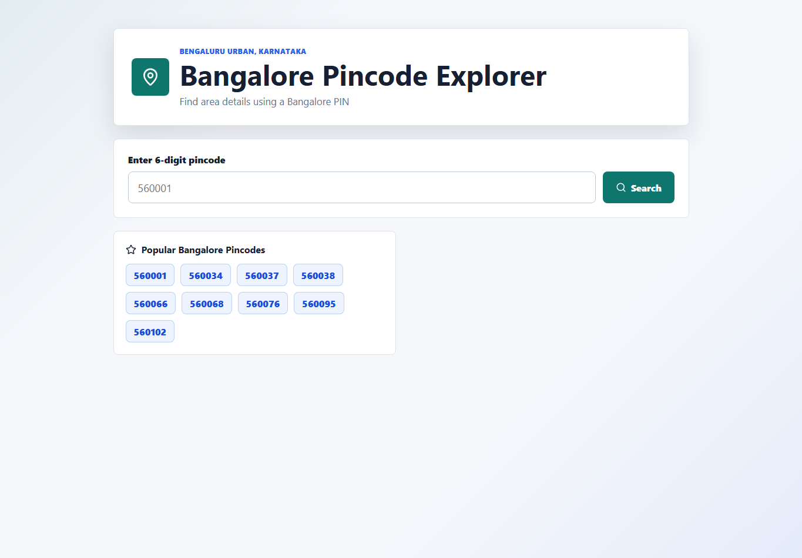

# Bangalore Pincode Explorer



A polished full-stack web application for searching Bangalore pincodes and viewing matching locality, district, state, and post-office details. It is built as a software development internship assignment using React, Express, REST APIs, and MySQL.

## Features

- Search by 6-digit Bangalore pincode
- Shows all matching areas when one pincode has multiple locality records
- Clear validation for empty, non-numeric, and wrong-length input
- Loading, not-found, backend, database, and network error states
- Recent searches stored in `localStorage`
- Clickable popular Bangalore pincodes
- Responsive, keyboard-friendly React UI
- Parameterized MySQL queries and centralized Express error handling
- Lightweight API tests for success, invalid input, and not-found cases

## Tech Stack

- Frontend: React.js with Vite
- Styling: CSS
- Backend: Node.js and Express.js
- Database: MySQL
- API: REST
- Language: JavaScript
- Tests: Jest and Supertest

## Architecture

The frontend calls the backend with `fetch`. The backend validates pincode input, runs parameterized MySQL queries through `mysql2`, and returns JSON responses. MySQL stores one row per pincode/locality combination, so a single pincode can return multiple areas.

## Folder Structure

```text
bangalore-pincode-explorer/
├── client/
│   ├── src/
│   │   ├── components/
│   │   ├── services/
│   │   ├── App.jsx
│   │   ├── main.jsx
│   │   └── index.css
│   ├── .env.example
│   ├── index.html
│   ├── package.json
│   └── vite.config.js
├── database/
│   ├── schema.sql
│   └── seed.sql
├── server/
│   ├── __tests__/
│   ├── config/
│   ├── controllers/
│   ├── data/
│   ├── middleware/
│   ├── routes/
│   ├── .env.example
│   ├── app.js
│   ├── package.json
│   └── server.js
├── .gitignore
├── README.md
└── package.json
```

## Installation

```bash
npm install
npm run install-all
```

## Environment Variables

Create `server/.env` from `server/.env.example`:

```env
PORT=5000
DB_HOST=localhost
DB_USER=root
DB_PASSWORD=
DB_NAME=bangalore_pincode_db
CLIENT_URL=http://localhost:5173
```

Create `client/.env` from `client/.env.example`:

```env
VITE_API_URL=http://localhost:5000/api
```

Never commit real `.env` files.

## MySQL Setup

Option 1: Run the SQL files manually.

```bash
mysql -u root -p < database/schema.sql
mysql -u root -p bangalore_pincode_db < database/seed.sql
```

Option 2: Use the backend seed script after creating `server/.env`.

```bash
npm run seed --prefix server
```

## Database Schema

```sql
CREATE TABLE pincodes (
    id INT AUTO_INCREMENT PRIMARY KEY,
    pincode VARCHAR(6) NOT NULL,
    area VARCHAR(150) NOT NULL,
    district VARCHAR(100),
    state VARCHAR(100),
    post_office VARCHAR(150),
    created_at TIMESTAMP DEFAULT CURRENT_TIMESTAMP,
    INDEX idx_pincode (pincode),
    INDEX idx_area (area)
);
```

## Sample Data Note

The included records are a sample Bangalore dataset meant to demonstrate the application. They are based on public India postal-directory references such as India Post-derived pages for [Bengaluru G.P.O.](https://pin.codes/560001), [Koramangala](https://pin.codes.in/pincode/560034/koramangala-s-o), [Marathahalli Colony](https://pin.codes.in/pincode/560037), [Indiranagar](https://www.postoffices.co.in/560038/), [Whitefield](https://www.bangalorepincode.com/pincode/560066-whitefield), [Bommanahalli/Madivala](https://olaw.in/pincode/560068), and [HSR Layout](https://pin.codes/560102/hsr-layout). For production use, replace or import a complete verified dataset from India Post or another trusted postal-data provider.

## Running the App

Run frontend and backend together:

```bash
npm run dev
```

Run backend only:

```bash
npm run dev --prefix server
```

Run frontend only:

```bash
npm run dev --prefix client
```

Frontend: `http://localhost:5173`

Backend: `http://localhost:5000`

## Tests

```bash
npm test
```

The tests cover:

- Valid pincode API request
- Invalid pincode format
- Pincode not found

## API Documentation

### Health Check

```http
GET /api/health
```

Response:

```json
{
  "status": "ok"
}
```

### Search by Pincode

```http
GET /api/pincodes/:pincode
```

Example:

```http
GET /api/pincodes/560001
```

Response:

```json
{
  "success": true,
  "pincode": "560001",
  "results": [
    {
      "area": "Bengaluru G.P.O.",
      "district": "Bengaluru Urban",
      "state": "Karnataka",
      "post_office": "Bengaluru G.P.O."
    }
  ]
}
```

### List Pincode Records

```http
GET /api/pincodes?page=1&limit=20&search=indiranagar
```

Response:

```json
{
  "success": true,
  "page": 1,
  "limit": 20,
  "total": 1,
  "totalPages": 1,
  "results": [
    {
      "id": 20,
      "pincode": "560038",
      "area": "Indiranagar",
      "district": "Bengaluru Urban",
      "state": "Karnataka",
      "post_office": "Indiranagar S.O"
    }
  ]
}
```

## Error Handling

- `400`: invalid pincode format
- `404`: pincode or route not found
- `503`: database unavailable
- `500`: unexpected server error

The frontend turns these into user-friendly messages and also handles network failures.

## Deployment

Frontend on Vercel or Netlify:

1. Set build command: `npm run build`
2. Set publish directory: `client/dist`
3. Set `VITE_API_URL` to your deployed backend API URL, for example `https://your-api.onrender.com/api`

For Vercel-only demos, the repository also includes serverless sample API routes under `api/`. If `VITE_API_URL` is not set in production, the React app calls `/api`, so the deployed frontend can demonstrate searches using the bundled sample dataset.

Backend on Render:

1. Create a Web Service from the GitHub repository
2. Set root directory to `server`
3. Set build command: `npm install`
4. Set start command: `npm start`
5. Add `PORT`, `DB_HOST`, `DB_USER`, `DB_PASSWORD`, `DB_NAME`, and `CLIENT_URL`

Database on Railway, Aiven, or another MySQL provider:

1. Create a MySQL database
2. Run `database/schema.sql`
3. Run `database/seed.sql`
4. Copy the provider credentials into backend environment variables

## Future Improvements

- Import a complete official India Post dataset
- Add admin-only CSV import for postal records
- Add frontend tests with React Testing Library
- Add sorting/filtering UI for the paginated pincode list API
- Add deployment screenshots to the README

## Suggested Repository Name

```text
bangalore-pincode-explorer
```

## Git Commands

```bash
git init
git add .
git commit -m "Build Bangalore Pincode Explorer"
git branch -M main
git remote add origin https://github.com/kanishik0011/bangalore-pincode-explorer.git
git push -u origin main
```

## 60-Second Interview Explanation

This project is a full-stack Bangalore pincode lookup app. The React frontend validates a 6-digit PIN, shows loading and error states, stores the last five searches in localStorage, and lets users click recent or popular pincodes. The Express backend exposes REST endpoints for health checks, exact pincode lookup, and paginated record listing. It uses MySQL through `mysql2`, parameterized queries to avoid SQL injection, CORS and Helmet for basic security, and centralized error handling so database or server failures return clean JSON responses. The database stores one row per pincode and locality, which allows a pincode like `560001` to return multiple matching post offices or areas.

## Internshala Submission Answer

I built a full-stack Bangalore Pincode Explorer using React, Vite, Node.js, Express.js, and MySQL. The app lets users search a 6-digit Bangalore pincode, validates input, displays all matching locality records, handles loading/error states, and stores recent searches in localStorage. The backend includes REST APIs, parameterized MySQL queries, centralized error handling, environment variables, seed SQL, and lightweight tests.

GitHub Repository: `[PASTE_GITHUB_REPO_LINK_HERE]`

Live Demo: `[PASTE_LIVE_DEMO_LINK_HERE]`

## Author

Kanishk Sai Kaushik

GitHub: https://github.com/kanishik0011
